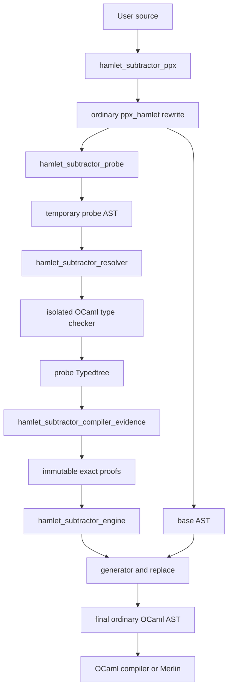
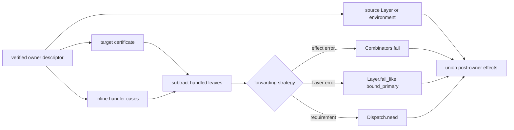
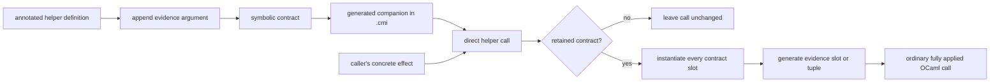

# Architecture

Hamlet Subtractor is a PPX with a short-lived compiler helper. The PPX owns the
source transformation; the helper, called the resolver, gives it exact typed
facts. The final result is ordinary OCaml.

## End-to-end flow



The temporary probe is never returned as user code. The resolver types it only
to discover declaration identities and exact effect rows. The final compiler
or Merlin sees and types only the final expansion.

## Base AST and probe AST

After `ppx_hamlet` has expanded services and primitives, the PPX keeps two
related trees.

The base AST is the program that will become the final output. It retains each
automatic marker until replacement.

The probe AST is a temporary copy. A marker is replaced by type-safe placeholder
code, and private attributes connect four expressions:

- the marker;
- its owning effect or Layer handler call;
- the input computation;
- the inline handler.

An owner descriptor states which argument is the target, how many leading
handler parameters precede the matched error or requirement, whether a source
Layer contributes additional effects, and which forwarding expression the
final code needs. This keeps effect `catch`/`provide` and the Layer owner family
on one checked path.

Stable IDs preserve those links after OCaml has rewritten the syntax into a
Typedtree. Locations still point to the user's live source, including an
unsaved Merlin buffer.

## Why a separate resolver exists

OCaml's compiler libraries keep mutable global state: include paths,
environments, loaded interfaces, type variables, and flags. Performing a
second type check inside a compiler or Merlin PPX process could corrupt the
host session.

The PPX therefore starts a matching resolver process. The resolver reconstructs
the reported compiler context, types one probe, returns immutable evidence, and
exits. No `Env.t`, mutable type expression, or Typedtree node crosses the
process boundary.

The request and response use a bounded, versioned protocol. It rejects missing
or duplicate evidence, stale versions, wrong AST digests, crashes, timeouts,
and oversized payloads.

Resolver installation and `staged_pps` are covered in
[Compiler and Editor Integration](./integration.md).

## Typed evidence

`hamlet_subtractor_compiler_evidence.ml` reads the probe Typedtree. It verifies
resolved declarations rather than printed names. A local function called
`catch`, `fail`, or `give` is therefore not accepted as a Hamlet primitive.

For each marker it proves:

- the two effect channels of the input computation;
- every complete error or requirement leaf;
- the handler arms that handle or explicitly forward a leaf;
- effects added by handler bodies and intervening combinators;
- dependencies on earlier markers or generic-helper calls.

Compiler-specific values are immediately converted into immutable values from
`subtractor/core`. The deterministic proof engine does not depend on
compiler-libs.

## Residual computation

For one channel, the engine computes:

```text
forwarded input = input - definitely handled leaves
output = forwarded input + effects introduced by handled branches
```

A guarded arm claims a leaf for code generation but does not remove it from the
forwarded input. An explicit `fail error` or `Dispatch.need witness` also keeps
the leaf.

Errors and requirements are tracked separately. A `catch` changes the error
channel while retaining requirements from its source and recovery code. A
`provide` changes requirements while retaining errors from the source and
provider code.

When several markers occur in one linear flow, the engine resolves the
dependency graph. A marker may use the exact output of an earlier marker, even
when `chain`, another `catch`, `provide`, or another supported primitive adds or
removes effects between them. Cyclic or ambiguous predecessor graphs are
refused.

## Layer owner flow

Layer providers have two independent inputs: the target whose requirements are
handled, and the source whose build effects remain afterward. `Layer.catch`
has one input, but generated forwarding also needs that exact Layer value to
preserve its hidden service key.



For `Layer.catch`, the base AST first binds the primary Layer expression to a
private value. Both the real catch call and every generated `Layer.fail_like`
branch use that value. Generated code therefore cannot repeat a source
expression with side effects or a freshly generated key.

When a Layer provider appears between markers, the target proof is transformed
by its requirement handler and the source Layer proof is added afterward. A
normal handler without an automatic marker is exact only when every target
requirement has an unguarded verified `give` or `need` arm. This lets an error
certificate from an earlier `Layer.catch` cross the provider. The resolver
checks declaration identities; it does not trust the names printed in the
handler.

## Generated code

`hamlet_subtractor_generator.ml` materializes forwarding branches. It uses the
representation proved for each leaf:

- a named `#Path.type` pattern;
- a structural polymorphic-variant pattern;
- a generated `Errors.Cases.dispatch` catalogue;
- a generated service-tag pattern.

The verified owner selects the branch result: `Combinators.fail` for an effect
error, `Layer.fail_like` for a Layer error, or `Dispatch.need` for a service
requirement. A generated `Errors.Cases` catalogue still proves the named leaves
of an imported Layer error row. Its callbacks return `Hamlet.t`, however, so a
Layer handler emits one verified named-leaf case instead of calling the
effect-only catalogue dispatcher.

`hamlet_subtractor_replace.ml` inserts those cases at the marker location and
removes every private probe attribute. If nothing remains, the marker's
refutation branch remains exhausted and normal OCaml warning 11 tells the user
that the marker is redundant.

The generated cases preserve user-facing locations. Helper nodes receive ghost
locations so diagnostics stay attached to meaningful source.

## Generic-helper flow

Generic helpers add a symbolic contract to the same architecture.



At the definition site:

1. `hamlet_subtractor_generic_definition.ml` validates the helper and rewrites
   each marker to call an evidence slot.
2. Compiler evidence builds symbolic input, recovery, and output expressions.
3. The exact contract is retained on a generated companion module declaration,
   because inferred value attributes do not survive in a `.cmi`.

At the call site:

1. `hamlet_subtractor_generic_call.ml` gives each plausible direct call a
   stable probe identity. Users write an ordinary call with no extra syntax.
2. In the isolated probe, the resolver uses compiler paths to distinguish a
   generic helper from an ordinary function. Ordinary calls are ignored.
3. For a generic helper, it loads the retained contract, selects the helper's
   effect argument, and proves that concrete input.
4. `hamlet_subtractor_generic_generator.ml` creates one exhaustive dispatcher
   per marker. Its two callbacks may return any common result type, so the same
   slot works for both error and requirement handlers.
5. The PPX appends the generated slot or tuple to the final call. Only this
   fully applied final call is seen by the compiler or Merlin.

The helper body is compiled once. Callers receive its symbolic contract, not
its source code.

### Nested generic helpers

An annotated helper may directly call an earlier generic helper. The outer
contract substitutes its symbolic source into the inner contract, namespaces
the inner slot IDs, and incorporates the inner output before resolving later
markers. The exported outer function still has one evidence argument; nested
and local slots are flattened into that bundle.

No body inlining occurs. Cross-module nesting uses the companion contract from
the dependency `.cmi`, while same-module nesting uses the already resolved
earlier definition. Recursive contracts are refused.

## Reading the code

- `subtractor/core` defines compiler-independent proof values and the pure
  algorithms that validate, combine, serialize, and instantiate them.
- `subtractor/core/owner_descriptor.ml` describes every supported marker owner:
  its channel, handler shape, extra contributor, and forwarding strategy.
- `subtractor/hamlet_subtractor_probe.ml` finds ordinary automatic markers and
  builds the linked base/probe pair.
- `subtractor/hamlet_subtractor_compiler_evidence.ml` verifies Typedtree facts
  and converts them into immutable exact or symbolic proofs.
- `subtractor/hamlet_subtractor_engine.ml` subtracts handled leaves and orders
  dependent ordinary markers.
- `subtractor/hamlet_subtractor_generator.ml` generates ordinary propagation
  cases; `hamlet_subtractor_replace.ml` splices them into the base AST.
- `subtractor/hamlet_subtractor_generic_definition.ml`,
  `hamlet_subtractor_generic_call.ml`, and
  `hamlet_subtractor_generic_generator.ml` implement the generic definition,
  call, and evidence-bundle phases.
- `subtractor/hamlet_subtractor_ppx.ml` coordinates the complete lifecycle and
  returns the final AST.
- `subtractor/hamlet_subtractor_resolver.ml` is the resolver executable entry
  point; its server types one prepared probe and returns immutable proof data.

For the exact value model and refusal rules, continue with
[Proof Model](./proof-model.md).
