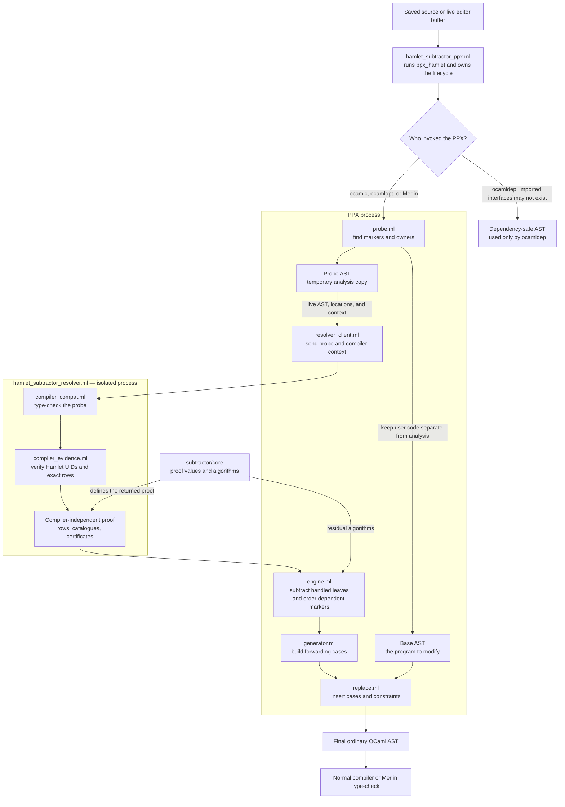

# Architecture

`hamlet-subtractor.ppx` replaces an automatic marker with exact forwarding
cases. It either proves the complete finite input row or reports an error that
asks for an explicit `%hamlet.te` or `%hamlet.ts` boundary.

Three compiler terms appear throughout this guide:

- an **AST** is OCaml syntax represented as data;
- a **Typedtree** is the compiler's AST after names and types have been
  resolved;
- a **UID** is the compiler identity of a resolved declaration. It
  distinguishes the real `Hamlet.Combinators.catch` from a local function with
  the same name.

## End-to-end flow



The separation has two purposes:

1. Compiler internals stay inside the resolver process. The PPX receives plain,
   immutable proof values rather than compiler state.
2. The temporary probe is never treated as the user's program. The compiler or
   Merlin accepts only the final AST produced after replacement.

The PPX starts the resolver automatically. How that executable is located is
explained in [Compiler and Editor Integration](./integration.md#resolver-process).

## The base and probe ASTs

`Hamlet_subtractor_probe.prepare` creates two related versions of the module.

### Base AST

The base AST contains the transformed user program and stable marker IDs. It
does not contain the temporary bindings used for analysis. Replacement always
starts here, which prevents probe code from appearing in builds or editor
output.

The PPX adds internal attributes to the original marker, its `catch` or
`provide` call, and the input expression. These attributes are links, not
proofs. They tell replacement where to insert generated cases and type
constraints. All of them are removed before the PPX returns.

### Probe AST

The probe is a type-safe analysis copy. An unresolved marker becomes a bottom
branch:

```ocaml
| _ -> (assert false [@hamlet.subtractor.marker.v1 "marker-id"])
```

The probe also binds the handler and upstream computation separately. This is
important because handler patterns can widen a polymorphic variant row during
type inference. The separate upstream binding lets the resolver inspect the
producer before that widening.

Probe-created bindings are never accepted as evidence by themselves. Evidence
must come from the original expression, an independently generalized user
value, a supported Hamlet construction, or an earlier resolved marker.

## Marker discovery

`ppx_hamlet` recognizes:

```ocaml
[%hamlet.propagate_e.auto]
[%hamlet.propagate_s.auto]
```

The syntax pass first checks that:

- the marker is the final match arm;
- its body is the refutation expression `.`;
- an error marker belongs to `catch` and a service marker to `provide`;
- the handler is inline;
- the owner is a supported direct or pipeline call.

These checks only identify a candidate. The Typedtree pass later verifies that
the owner resolves to Hamlet's actual `catch` or `provide` UID.

Every candidate receives an ID derived from its source location and transformed
source. The ID correlates the base AST, probe AST, resolver response, and final
replacement during one PPX invocation. Correctness does not depend on a
persistent marker cache.

## PPX invocation modes

The same executable serves three callers:

| Caller | What the PPX returns | Why |
| --- | --- | --- |
| `ocamldep` | A dependency-safe AST with no probe attributes | Dune may not have built imported `.cmi` files yet. This pass only discovers dependencies. |
| `ocamlc` or `ocamlopt` | The fully resolved final AST | Dependency interfaces are available and the compiler will type-check the result. |
| Merlin | The same final AST, built from the live buffer | Hover and diagnostics must describe the code currently open in the editor. |

An ordinary Dune `pps` invocation identifies itself as an early PPX driver. If
it contains automatic markers, the subtractor reports that `staged_pps` is
required.

## From the probe to an exact proof

The PPX serializes the already transformed probe AST with its source locations
and sends it to the resolver. It does not reread the source file. This is why
unsaved changes in the active editor buffer survive the process boundary.

Inside the resolver:

1. `hamlet_subtractor_compiler_compat.ml` recreates the relevant compiler
   context and type-checks the probe in a fresh compiler store.
2. `hamlet_subtractor_compiler_evidence.ml` finds the linked Typedtree nodes.
3. It verifies the real Hamlet owner, combinator, service-tag, and catalogue
   identities.
4. It reads the exact source rows before handler widening.
5. It classifies preceding handler arms and the effects of recovery code.
6. It converts every accepted fact into values defined by `subtractor/core`.

No `Typedtree`, compiler environment, mutable type expression, or compiler UID
is returned to the PPX. The resolver response contains only exact leaves,
catalogues, certificates, source spans, and structured refusals.

The response is accepted only if its request ID, compiler context, probe digest,
and marker set match the current invocation. A partial or mismatched response
is an error; the PPX never fills gaps with guesses.

## Residual and marker dependencies

For one channel, the engine computes:

```text
generated residual = input leaves
                     - handled leaves
                     - explicitly forwarded leaves

final output = generated residual
               + explicitly forwarded leaves
               + effects introduced by recovery code
```

Only the generated residual becomes new match cases. User recovery branches
remain unchanged.

A marker may consume the result of an earlier marker:

```ocaml
let first = catch source ~handler:first_handler
let second = catch first ~handler:second_handler
```

The Typedtree records that `second` uses the value bound as `first`. The engine
therefore resolves `first`, passes its complete error-and-requirement
certificate to `second`, and then resolves `second`.

The earlier result may sit inside supported composition:

```ocaml
let with_new_effect =
  let* value = first in
  operation_that_adds_a_known_effect value
```

The evidence layer builds a small source plan: “certificate from `first`,
chained with the exact certificate of `operation_that_adds_a_known_effect`.”
The engine fills in `first` only after resolving it, unions both channels, and
uses that combined certificate as the next marker's input.

Each marker may have at most one earlier marker predecessor, but a linear chain
may contain any number of markers and exact new contributions. Cycles, opaque
links, and merges of two independently marked values receive deterministic
errors.

## Generated code

The generator uses four forms.

### Named leaf

```ocaml
| #Storage.Errors.write_error as error ->
    Hamlet.Combinators.fail error
```

This is used when a complete leaf has a source-level path.

### Structural variant

```ocaml
| `Retry_later as error -> Hamlet.Combinators.fail error
| `Unavailable _ as error -> Hamlet.Combinators.fail error
```

This is allowed only when the closed proof determines the label and payload
arity unambiguously.

### External catalogue

For a complete generated error universe from another module, the PPX uses its
validated `Errors.Cases` catalogue. This avoids nested structural matching and
keeps generated code linear in the number of declared leaves.

### Empty residual

If earlier arms handled every leaf, the generated branch remains unreachable.
OCaml warning 11 then reports the redundant marker.

Every nonempty generated fallback ends with a ghost wildcard refutation. The
final type checker accepts that refutation only if the generated patterns cover
the actual handler input.

Replacement also adds ordinary OCaml type constraints to:

- the original input expression, using the row from which subtraction was
  computed;
- the complete `catch` or `provide` result, using the final error and
  requirement certificate.

These constraints prevent later type inference from widening the proven input
or output. They are checked by the normal compiler, not trusted from the probe.

## Worked examples

For errors:

```text
input                 { read_error, write_error, network_error }
handled               { read_error }
generated residual    { write_error, network_error }
recovery contribution { recovery_error }
final error row        { write_error, network_error, recovery_error }
```

For requirements:

```text
input                  { Logger, Clock, Database }
provided               { Logger }
explicitly forwarded   { Clock }
generated residual     { Database }
final requirement row  { Clock, Database }
```

`provide` leaves the computation's error channel unchanged.

## Why the final type is precise

The compiler and Merlin never type the probe as user code. They receive only
the final AST containing the proven forwarding cases and constraints. Recovery
branches remain normal user code, so their effects are inferred and combined
with the generated residual in the usual OCaml type check.

The acceptance tests inspect the final PPX output, the Typedtree Merlin types,
and hovers for saved and unsaved buffers. They fail if probe assertions or
internal attributes escape into the final AST.
